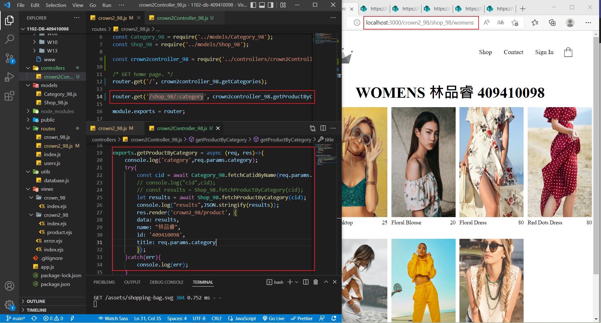
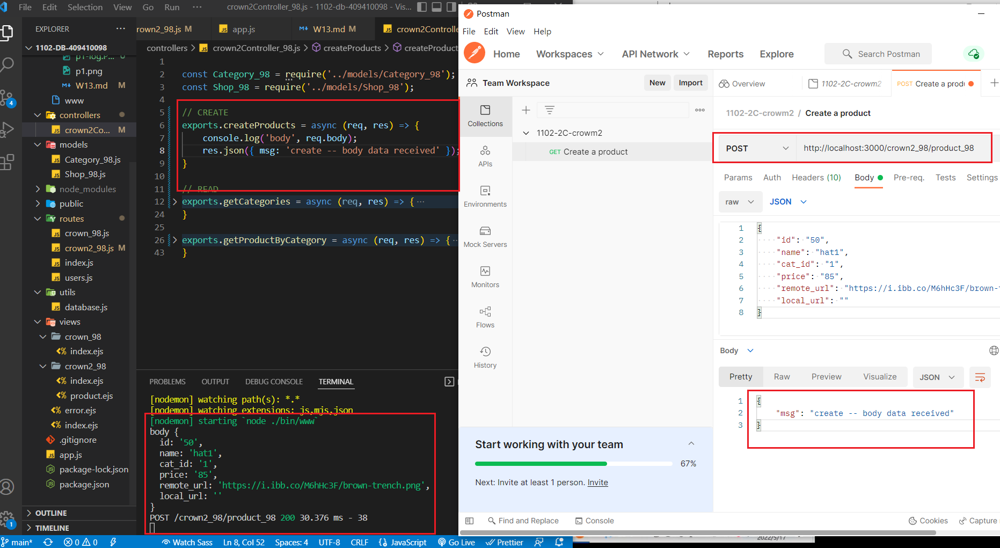

### w13-p1: create controllers for crown2 for MVC architecture




```
$ git log --pretty=format:"%h%x09%an%x09%ad%x09%s" --after="2022-06-17"
c14a3bf ray0630 Sat Jun 18 18:50:46 2022 +0800  w13-p1: create controllers for crown2 for MVC architecture
```

### w13-p2 use Postman to test product body data can be retrieved using route /crown2_xx/product_xx


