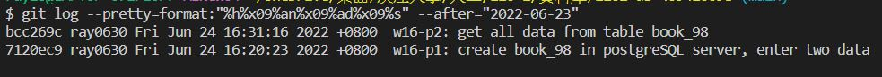

### w16-p1: create book_98 in postgreSQL server, enter two data


```
$ git log --pretty=format:"%h%x09%an%x09%ad%x09%s" --after="2022-06-23"
7120ec9 ray0630 Fri Jun 24 16:20:23 2022 +0800  w16-p1: create book_98 in postgreSQL server, enter two data
```
### w16-p2: get all data from table book_xx



```
$ git log --pretty=format:"%h%x09%an%x09%ad%x09%s" --after="2022-06-23"
bcc269c ray0630 Fri Jun 24 16:31:16 2022 +0800  w16-p2: get all data from table book_98
7120ec9 ray0630 Fri Jun 24 16:20:23 2022 +0800  w16-p1: create book_98 in postgreSQL server, enter two data
```

### w16-p3: /book_xx/create to book_xx/add_xx.ejs


```
$ git log --pretty=format:"%h%x09%an%x09%ad%x09%s" --after="2022-06-23"
9c6df69 ray0630 Fri Jun 24 17:09:51 2022 +0800  w16-p3: /book_xx/create to book_xx/add_xx.ejs
bcc269c ray0630 Fri Jun 24 16:31:16 2022 +0800  w16-p2: get all data from table book_98
7120ec9 ray0630 Fri Jun 24 16:20:23 2022 +0800  w16-p1: create book_98 in postgreSQL server, enter two data
```

### w16-p4: POST /book_xx/create to create a book data


