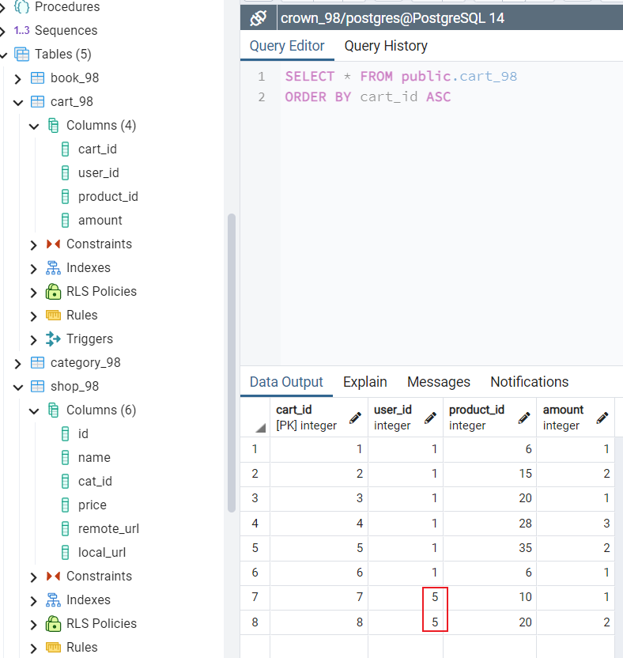
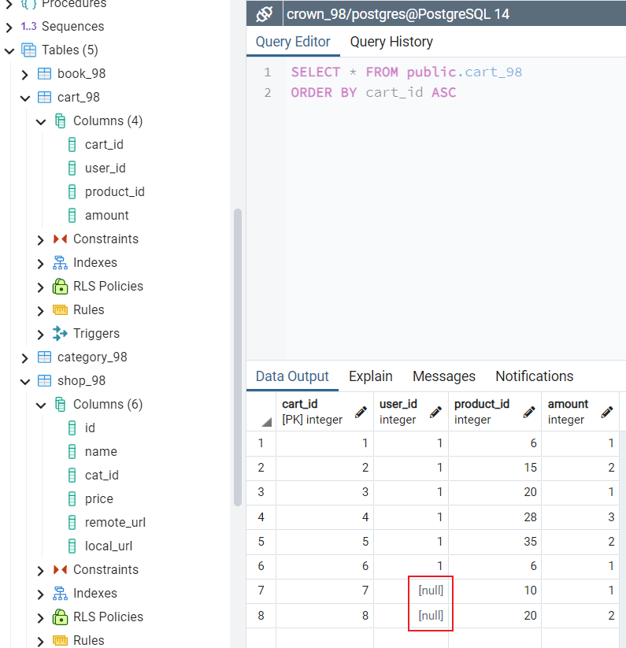
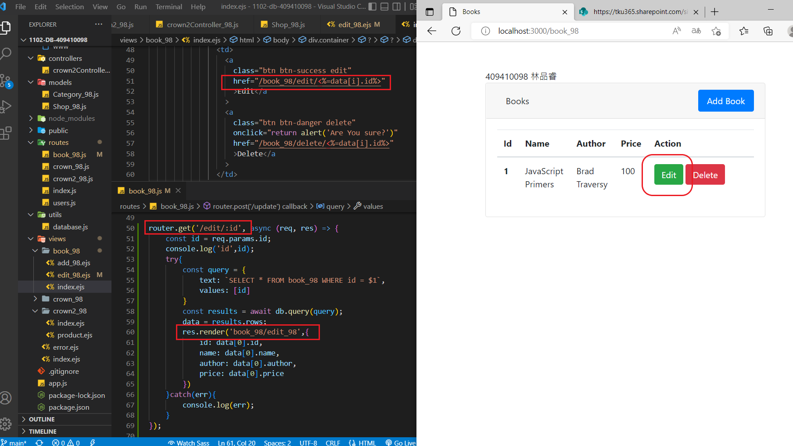
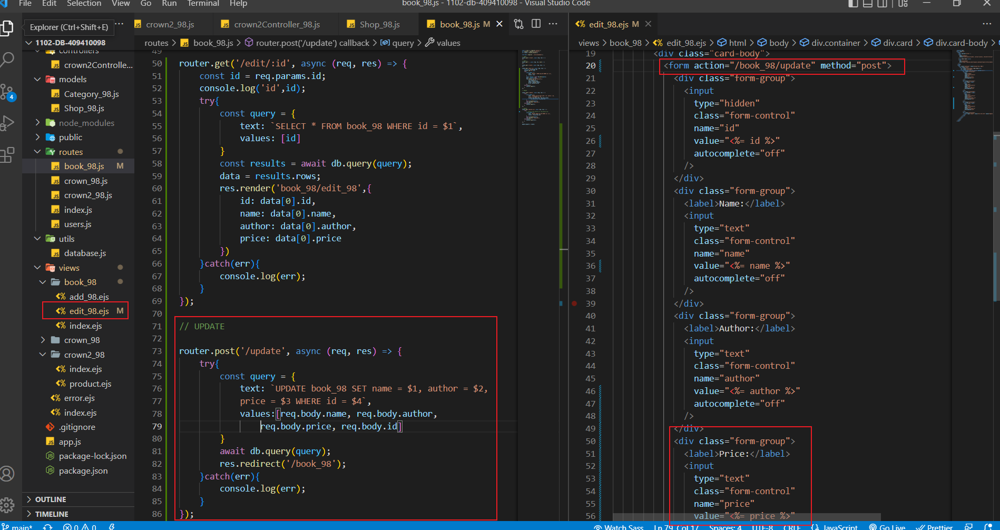

### w17-p1: create user_xx in postgreSQL server, enter two data, the first one is about your


### w17-p2: create cart_xx in postgreSQL server, enter five data, one for each category


### w17-p3: give query to get related data for cart info shown in ejs


### w17-p4: insert data in order to violate the key constraints, foreign key constraints


### w17-p5.1: test ON UPDATE CASCASE




### w17-p5.2: test ON DELETE SET NULL




### w17-p6: implement /book_xx/delete/:id


```
$ git log --pretty=format:"%h%x09%an%x09%ad%x09%s" --after="2022-06-24"
1090fab ray0630 Sat Jun 25 07:08:29 2022 +0800  ### w17-p6: implement /book_xx/delete/:id
```

### w17-p7: implement /book_xx/update




### w17-LAST-log


```
$ git log --pretty=format:"%h%x09%an%x09%ad%x09%s" --after="2022-06-24"
92b1101 ray0630 Sat Jun 25 07:59:02 2022 +0800  w17-p7: implement /book_xx/update
1090fab ray0630 Sat Jun 25 07:08:29 2022 +0800  ### w17-p6: implement /book_xx/delete/:id
```

